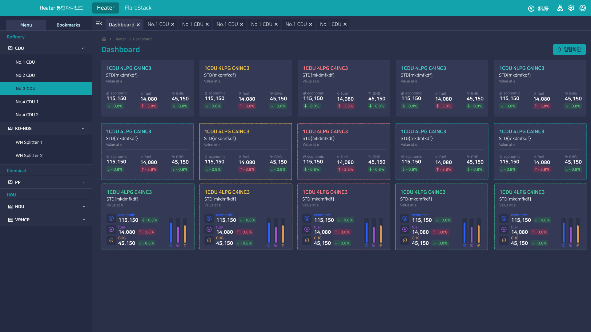
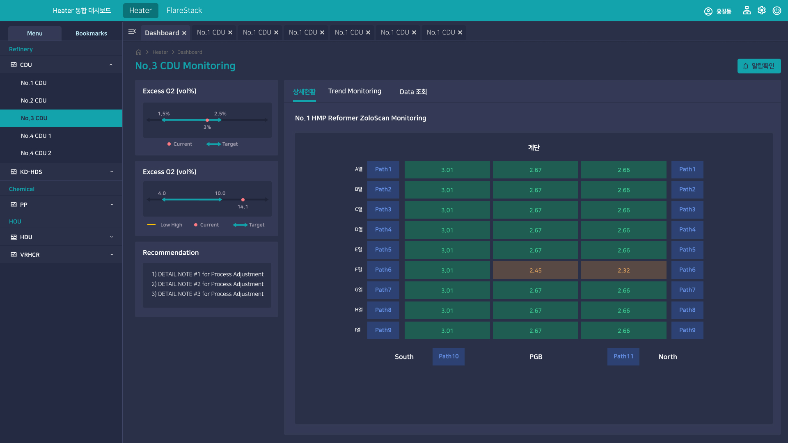

> **[핵심 Takeaway]**
> 석유화학 공장의 실시간 공정 데이터를 시각화한 산업용 모니터링 대시보드로, **데이터 집약적 UI**의 대표 사례다.
> 여러 CDU(증류 유닛) 단위의 수치를 카드 그리드로 배치하고 Trend Monitoring·Data 조회를 탭으로 구성한 설계는 "복잡한 정보 구조를 사용자가 파악하기 쉽게 정리하는 FE 능력"으로 어필해야 한다.
> 다크 테마 + 데이터 밀도 높은 UI가 포트폴리오에서 시각적으로 임팩트가 강한 프로젝트.

# GS칼텍스 여수공장 통합 대시보드

| 항목 | 내용 |
|------|------|
| 발주처 | GS칼텍스 |
| 기간 | 2025.04 ~ 2025.06 |
| 역할 | 퍼블리싱 + 프론트 개발 |
| 기술 | OutSystems |
| 시스템명 | Heater 통합 대시보드 |

---

## 시스템 개요

GS칼텍스 여수 정유공장의 **Heater·FlareStack 설비 실시간 모니터링** 시스템. 여러 공정 유닛(CDU, KD-HDS, Chemical, HOU 등)의 Economic·Fuel·GHG 지표를 통합 시각화.

---

## 주요 화면 구성

### Dashboard (메인 — 다크 테마)

- **좌측 사이드바:** 공정 구조 트리 (Refinery → CDU → No.1~4 CDU / KD-HDS / Chemical / HOU / VRHCR)
- **상단 탭 네비게이션:** Dashboard + CDU별 멀티탭 (No.1 CDU × 6개)
- **카드 그리드:** 각 Heater 유닛별 카드 (경제성·연료·GHG 수치 + 등락 표시)
  - Economic: 115,150 (↓0.8%)
  - Fuel: 14,080 (↑3.8%)
  - GHG: 45,150 (↓0.8%)
- **카드 하단 미니 차트:** 실시간 트렌드 인디케이터
- **알람확인 버튼:** 상단 우측 글로벌 알람

### CDU 상세 모니터링

- **No.3 CDU Monitoring** 상세 페이지
- Excess O2(vol%) 게이지: Low/High 범위 + Current/Target 표시
- 권고사항(Recommendation) 패널: AI 기반 Process Adjustment 노트
- **HMP Reformer ZoloScan Monitoring:** Path×열(A~I) 그리드 매트릭스
  - 정상값(초록)/경고값(주황) 컬러 코딩
  - South·PGB·North 방향 축

---

## 기술적 구현 특징

| 구현 요소 | 설명 |
|---------|------|
| 멀티탭 시스템 | 여러 CDU를 동시에 탭으로 열어 비교 가능 |
| 실시간 수치 + 등락 표시 | 숫자 + 화살표 + 퍼센트 변화율 복합 표현 |
| 컬러 코딩 상태 표시 | 정상(초록)/경고(주황)/위험(빨강) 시각적 구분 |
| 다크 테마 UI | 산업 현장 모니터링에 최적화된 고대비 테마 |
| 트리 기반 사이드 내비 | 계층적 공정 구조를 접기/펼치기 트리로 표현 |
| 그리드 매트릭스 | ZoloScan Path 데이터를 2D 열×행 그리드로 시각화 |

---

## 포트폴리오 서술 구조

- **문제:** 수십 개 공정 유닛의 실시간 데이터를 운영자가 한눈에 파악할 수 없음
- **원인:** 유닛별 데이터가 분산되어 있고, 경보 기준치와 실측값 비교가 직관적이지 않음
- **해결:** 카드 그리드 + 트리 내비 + 멀티탭으로 계층적 정보 구조 설계. 컬러 코딩으로 상태 즉시 인식
- **구현:** 다크 테마 컴포넌트 시스템, 실시간 데이터 바인딩, 게이지/그리드 복합 레이아웃
- **결과:** 운영자가 공정별 이상 징후를 대시보드 단일 화면에서 즉시 파악 가능
- **배운 점:** 데이터 밀도가 높은 UI일수록 정보 계층과 시각적 우선순위 설계가 핵심

---

*관련 페이지: [[career-nulenn]], [[project-sk-safety]], [[project-gs-fuel]]*
*최종 수정: 2026-06-07*
