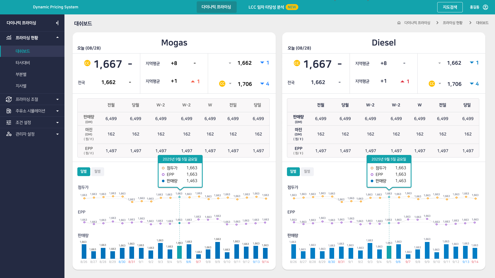

> **[핵심 Takeaway]**
> 이 프로젝트의 핵심은 가격 차트가 아니라 **지도 기반 입지 분석(LCC 타당성 분석)의 단계별 검색 UX** — 전국 지도에서 시군구, 명칭 순으로 지역을 단계적으로 좁혀가며 원하는 주유소를 찾는 흐름을 직접 설계했다.
> Vue 기반 프로젝트로 OutSystems 외에 **모던 JS 프레임워크 실무 경험**이 있음을 증명하는 사례이기도 하다.

# GS칼텍스 유가 관리 시스템

| 항목 | 내용 |
|------|------|
| 발주처 | GS칼텍스 |
| 기간 | 2025.10 ~ 2026.01 |
| 역할 | 퍼블리싱 |
| 기술 | Vue |
| 시스템명 | Dynamic Pricing System |

---

## 시스템 개요

GS칼텍스 주유소 네트워크의 **유류 가격 동적 관리 시스템**. 전국·지역별 Mogas(휘발유)·Diesel(경유) 가격 현황 모니터링, 프라이싱 시뮬레이션, LCC 입차 타당성 분석 기능 포함.

---

## 주요 화면 구성

### 지도 기반 입지 분석 (LCC 타당성 분석) — 핵심 기능

- **전국 지도검색:** 전국 단위로 주유소 분포를 지도에서 조망
- **시군구 검색:** 지역을 시군구 단위로 좁혀서 탐색
- **명칭검색:** 특정 주유소명으로 정확히 검색
- **마커 표시:** 검색 결과를 지도 위 마커로 시각화
- 전국 → 시군구 → 명칭 순으로 **단계적으로 좁혀가는 검색 흐름**을 직접 설계
- 이어서 입지 시뮬레이션 실행 → 성과평가 결과까지 하나의 플로우로 연결

### 가격 대시보드 (보조 기능)

- **Mogas / Diesel 병렬 패널** — 오늘 가격, 지역평균, 전국 평균 비교
- 정두가·EPP·판매량 3중 시계열 차트, 일별/월별 전환 탭
- 복합 데이터 테이블: 전월·당월·전일·당일 판매량/마진/EPP

---

## 기술적 구현 특징

| 구현 요소 | 설명 |
|---------|------|
| 단계별 지역 검색 UX | 전국 → 시군구 → 명칭으로 좁혀가는 지도 검색 흐름 설계 |
| 지도 마커 시각화 | 검색 결과를 지도 API 마커로 표시 |
| Vue 프레임워크 | OutSystems 외 모던 JS 프레임워크 실무 경험 |
| 멀티 시계열 차트 | 정두가·EPP·판매량 3개 지표 동시 라인 차트 |
| 병렬 패널 레이아웃 | Mogas/Diesel 동일 구조 나란히 비교 |
| 복합 데이터 테이블 | 기간별 복수 지표 교차 테이블 |

---

## 포트폴리오 서술 구조

- **문제:** 전국 단위의 방대한 주유소 입지 데이터에서 원하는 지역·주유소를 빠르게 찾기 어려움
- **해결:** 전국 → 시군구 → 명칭 순으로 단계적으로 좁혀가는 지도 검색 UX를 직접 설계, 결과를 마커로 시각화
- **구현:** Vue 기반 지도 API 연동, 단계별 검색 상태 관리, 병렬 패널 가격 대시보드
- **결과:** 방대한 입지 데이터에서 원하는 주유소를 몇 단계 클릭만으로 찾을 수 있게 됨
- **배운 점:** 데이터가 방대할수록 한 번에 보여주기보다 단계적으로 좁혀가는 탐색 흐름 설계가 중요하다는 것을 체감

---

*관련 페이지: [[career-nulenn]], [[project-gs-dashboard]], [[project-hanwha-crm]], [[project-gs-performance]]*
*최종 수정: 2026-07-21 (지도 검색 UX를 핵심 기능으로 재정리)*
