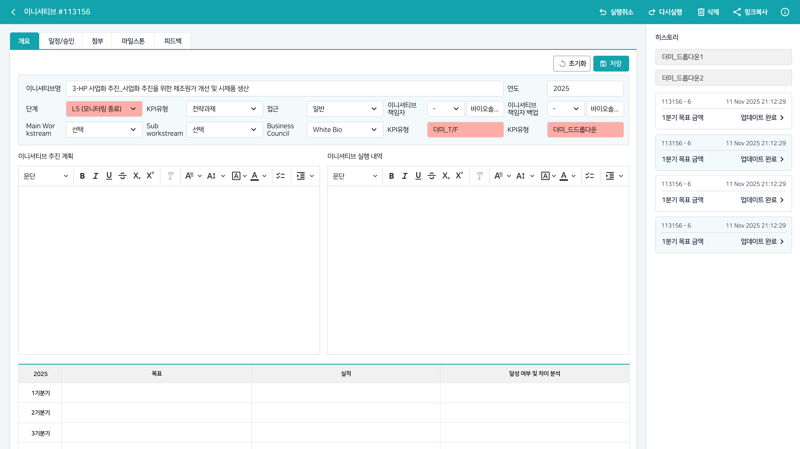
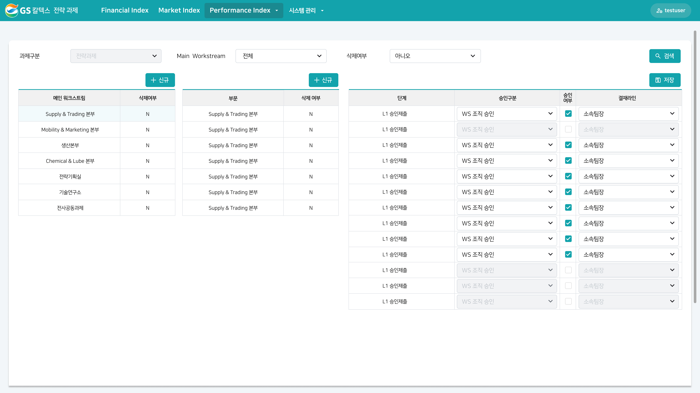
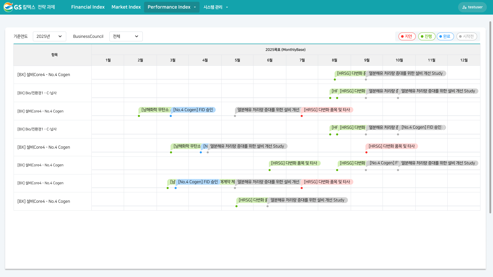

> **[핵심 Takeaway]**
> **정적 디자인 시안만 받은 상태에서 인터랙션을 직접 설계**한 사례. "디자이너가 화면만 주면 FE가 알아서 만든다"가 아니라, 인터랙션 자체를 FE가 기획했다는 것을 보여주는 핵심 프로젝트.
> Business Council 보고 화면에서 프로젝트 호버 시 기간만큼 게이지 바가 애니메이션으로 채워지고 나머지 프로젝트는 디밍되는 포커싱 인터랙션은 "UI 구현을 넘어선 인터랙션 설계 역량"으로 반드시 어필할 것.

# GS칼텍스 전략 성과관리 시스템

| 항목 | 내용 |
|------|------|
| 발주처 | GS칼텍스 |
| 기간 | 2025.10 ~ 2026.01 |
| 역할 | 프론트엔드 UI 구현 |
| 기술 | OutSystems |

---

## 시스템 개요

GS칼텍스의 **전사 전략 과제(워크스트림)와 전략 KPI 진행 현황을 관리**하는 성과관리 시스템. KPI 개요·리스트·일정 뷰, 워크스트림 관리, 경영진 대상 Business Council 보고 화면으로 구성.

---

## 문제 → 해결 (핵심 스토리)

- **문제:** 기존 As-Is 화면은 스크롤이 지나치게 길어서, 경영진이 보고 시 프로젝트 현황을 한눈에 파악하기 불편하다는 의견이 나왔음
- **받은 것:** 디자이너로부터 개선된 정적 디자인(경영진 보고 화면) 1장만 전달받음 — 인터랙션 명세는 없었음
- **직접 설계한 것:** 정적 디자인만 보고 인터랙션을 스스로 기획·구현
  - 프로젝트 항목에 마우스를 호버하면, 해당 프로젝트의 기간만큼 게이지 바가 왼쪽→오른쪽으로 차오르는 애니메이션 실행
  - 동시에 호버되지 않은 나머지 프로젝트는 흐리게(디밍) 처리해 호버 중인 프로젝트에 시각적으로 포커스
- **결과:** 스크롤 없이, 관심 있는 프로젝트의 진행 기간을 직관적으로 비교·파악 가능
- **배운 점:** 정적 디자인 시안만 주어져도 인터랙션 설계는 FE의 몫이라는 것을 체감

---

## 주요 화면 구성

### 전략 KPI 관리

- **개요 뷰:** KPI 현황 요약
- **리스트 뷰:** KPI 항목별 상세 테이블
- **일정 뷰:** KPI 진행 일정 관리

### 워크스트림 관리

- 전사 전략 과제(워크스트림) 진행 현황 관리 화면

### As-Is → To-Be 비교 — 호버 포커싱 인터랙션

포트폴리오 디테일 페이지에서는 As-Is 화면과 To-Be(Business Council 보고 화면)를 **한 슬라이드에 나란히** 배치해 개선 전/후를 한눈에 비교하도록 구성.

- **As-Is:** 스크롤이 매우 긴 화면 (실제 스크린샷 자체가 세로로 긴 이미지 — 문제를 시각적으로도 증명)
- **To-Be:** 스크롤 없이 한 화면에 담긴 Business Council 보고 화면
- 디자이너에게는 To-Be의 정적 디자인만 전달받았고, **호버 시 게이지 바 애니메이션 + 나머지 프로젝트 디밍 인터랙션은 직접 설계**
- 스크린샷은 정적 상태만 보여주므로, 포트폴리오에서는 이 인터랙션을 텍스트나 GIF/영상으로 반드시 별도 설명 필요

---

## 포트폴리오 서술 구조

- **문제:** As-Is 화면의 스크롤 과다로 경영진이 프로젝트 현황을 한눈에 파악하기 어려웠음
- **해결:** 정적 디자인만 받은 상태에서 호버 인터랙션(진행률 게이지 애니메이션 + 포커스 디밍)을 직접 설계
- **구현:** OutSystems 기반 호버 이벤트 처리, 기간 비례 게이지 애니메이션, 비호버 항목 디밍 처리
- **결과:** 스크롤 없이 프로젝트별 진행 기간을 직관적으로 비교·파악 가능
- **배운 점:** 정적 디자인 시안도 인터랙션은 FE가 직접 설계해야 한다는 것

---

*관련 페이지: [[career-nulenn]], [[project-gs-fuel]], [[project-gs-dashboard]]*
*최종 수정: 2026-07-21 (As-Is/To-Be 비교 슬라이드로 통합)*
