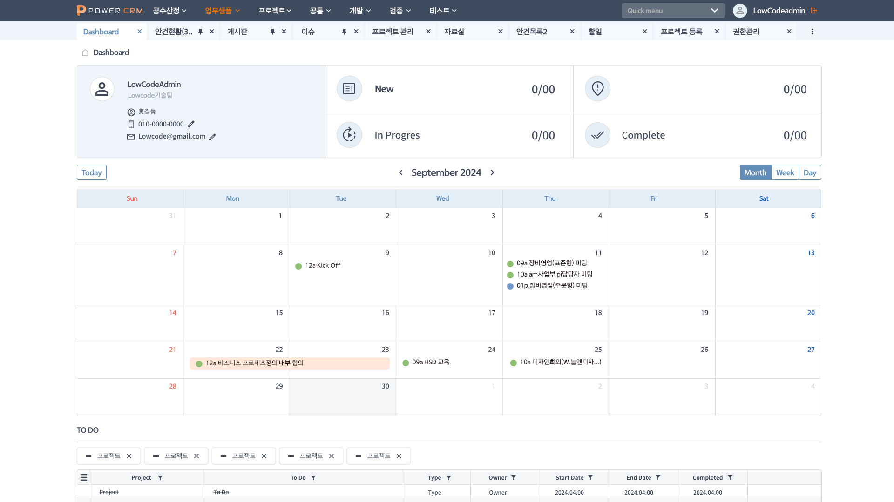
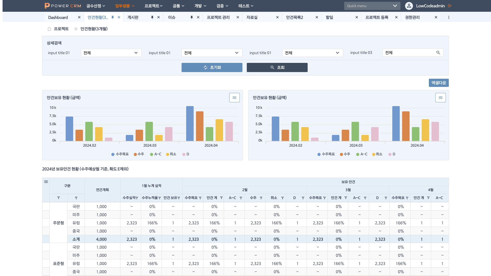

> **[핵심 Takeaway]**
> 복잡한 B2B 영업 데이터(안건 보유 현황, 수주목표 vs 수주 실적)를 차트 + 복합 테이블로 표현한 CRM 시스템.
> 다중 탭 네비게이션(Dashboard·안건현황·게시판·이슈·프로젝트관리·자료실·안건목록·할일·프로젝트등록·권한관리)으로 구성된 복잡한 업무 시스템 경험은 "엔터프라이즈급 UI 구조 설계 능력"으로 어필 가능.

# 한화 파워시스템 CRM

| 항목 | 내용 |
|------|------|
| 발주처 | 한화 파워시스템 |
| 기간 | 2024.05 ~ 2024.08 |
| 역할 | 퍼블리싱 |
| 기술 | OutSystems |
| 시스템명 | POWER CRM |

---

## 시스템 개요

한화 파워시스템의 **영업 프로젝트 안건 관리 CRM**. 공수산정·업무샘플·프로젝트·공통·개발·검증·테스트 기능을 포함한 엔터프라이즈 CRM.

---

## 주요 화면 구성

### Dashboard (메인)

- **사용자 프로필 위젯:** 이름·소속팀·연락처·이메일 + 인라인 편집(연필 아이콘)
- **프로젝트 상태 요약:** New 0/00 / In Progress 0/00 / Complete 0/00 (4개 상태 카드)
- **월간 캘린더:** Today 버튼 + Month/Week/Day 전환 탭, 이벤트 인라인 표시
- **TO DO 섹션:** 프로젝트 필터 태그(×) + 테이블 (Project·To Do·Type·Owner·Start/End Date·Completed 컬럼)

### 안건현황 상세

- **4중 상세검색 필터:** 검색 조건별 드롭다운 + 초기화/조회 버튼
- **안건보유 현황 차트 (병렬 2개):** 월별 수주목표·수주·A~C·취소·D 5개 지표 막대그래프
- **복합 데이터 테이블:** 2024년 보유안건 현황
  - 구분(주문형/표준형) × 국판/미주/유럽/중국 × 연간계획 × 월별 누적실적 × 보유 안건 수
  - 소계 강조 행, 0%/수치 혼합 표현

---

## 주요 탭 구조

상단 탭 바: `Dashboard` · `안건현황(3...)` · `게시판` · `이슈` · `프로젝트 관리` · `자료실` · `안건목록2` · `할일` · `프로젝트 등록` · `권한관리` · `...`(더보기)

---

## 기술적 구현 특징

| 구현 요소 | 설명 |
|---------|------|
| 다중 탭 네비게이션 | 10개 이상 기능 탭 + 오버플로우 처리 |
| 병렬 막대그래프 | 동일 구조 차트 2개 나란히 비교 레이아웃 |
| 복합 피벗 테이블 | 행·열 다중 그룹핑 + 소계 강조 |
| 인라인 편집 UI | 프로필 정보 클릭하여 바로 수정 |
| 캘린더 + 이벤트 | 월/주/일 뷰 전환, 이벤트 인라인 표시 |
| 엑셀 다운로드 | 복잡한 테이블 데이터 엑셀 내보내기 |

---

## 포트폴리오 서술 구조

- **문제:** 안건 데이터가 구분·지역·연간계획·월별 실적 등 다차원으로 얽혀 있어, 숫자만 나열하면 한눈에 안 들어옴
- **해결:** 행·열 다중 그룹핑 + 소계 강조 피벗 테이블 구현, 수주목표 vs 실적을 병렬 막대그래프로 나란히 배치해 비교
- **구현:** 다중 탭 SPA 구조, 피벗 테이블 렌더링, 복합 필터 시스템
- **결과:** 영업팀이 복잡한 다차원 데이터를 표+차트 조합으로 한 화면에서 비교·파악 가능
- **배운 점:** 복잡한 엔터프라이즈 데이터는 테이블 하나에 욱여넣기보다 표와 차트에 역할을 나눠줘야 한다는 것을 체감

---

*관련 페이지: [[career-nulenn]], [[project-gs-fuel]], [[project-gs-dashboard]]*
*최종 수정: 2026-07-21*
