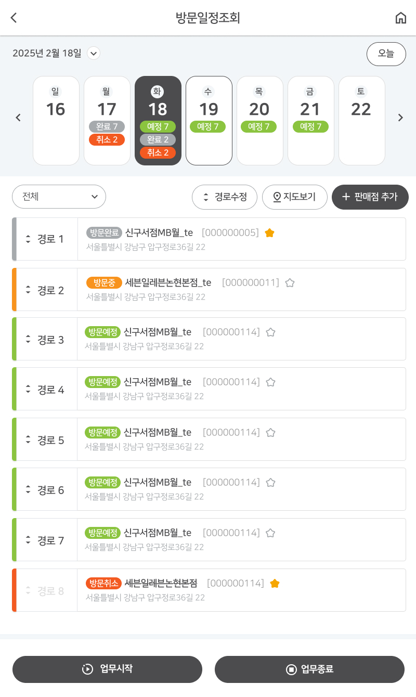

> **[핵심 Takeaway]**
> 유일한 **모바일 앱 UI** 프로젝트로, 데스크탑 중심의 다른 프로젝트와 차별화되는 반응형·모바일 UX 경험을 증명한다.
> 영업사원의 일과 동선을 관리하는 UX — 주간 캘린더, 경로 리스트, 상태 배지, 업무시작/종료 — 는 "사용자 워크플로우 중심의 UI 설계 능력"으로 어필 가능.

# KT&G 영업 관리 시스템 (모바일)

| 항목 | 내용 |
|------|------|
| 발주처 | KT&G |
| 기간 | 2025.03 ~ 2025.05 |
| 역할 | 퍼블리싱 |
| 기술 | OutSystems |
| 특징 | 모바일 전용 UI |

---

## 시스템 개요

KT&G 영업사원의 **일일 방문 일정 및 경로 관리** 모바일 앱. 담배 판매점 방문 경로 계획·실행·완료 상태를 모바일에서 실시간 추적.

---

## 주요 화면 구성

### 방문일정조회 (메인 — 모바일)

- **상단 주간 캘린더:** 날짜 카드 슬라이더 (일~토). 각 날짜별 완료/취소/예정 건수 뱃지
  - 선택된 날짜(화 18일): 예정7 / 완료2 / 취소2
- **필터 툴바:** 전체/경로 드롭다운, 경로수정 / 지도보기 / + 판매점 추가
- **경로 리스트:** 8개 경로 카드
  - 상태 배지: 방문완료(회색) / 방문중(주황) / 방문예정(초록) / 방문취소(취소선)
  - 좌측 컬러 바 상태 표시
  - 판매점명 + 코드 + 즐겨찾기(별)
  - 상세 주소
  - 드래그 핸들(순서 변경)
- **하단 고정 버튼:** 업무시작(재생) / 업무종료(정지)

---

## 기술적 구현 특징

| 구현 요소 | 설명 |
|---------|------|
| 모바일 전용 레이아웃 | 세로 스크롤 중심, 터치 인터랙션 최적화 |
| 주간 캘린더 슬라이더 | 날짜 카드 가로 스크롤 + 상태 뱃지 복합 표현 |
| 상태 배지 시스템 | 4가지 방문 상태별 컬러 코딩 |
| 드래그 핸들 | 경로 순서 변경을 위한 터치 드래그 UI |
| 고정 하단 CTA 버튼 | 업무 시작/종료 플로팅 액션 버튼 |
| 지도 연동 준비 | 지도보기 버튼으로 지도 API 연동 인터페이스 |

---

## 포트폴리오 서술 구조

- **문제:** 영업사원이 하루 수십 곳의 판매점을 방문하는 동선을 효율적으로 관리하지 못함
- **해결:** 모바일에서 경로 계획→방문 실행→완료 확인까지 원스톱 UX 설계
- **구현:** 터치 최적화 모바일 레이아웃, 드래그 경로 재정렬, 실시간 방문 상태 업데이트
- **결과:** 업무 시작/종료 버튼으로 일과 시작을 앱 내에서 완결, 방문 상태 실시간 시각화
- **배운 점:** 모바일 UX는 정보 밀도보다 액션 진입점의 명확성이 핵심

---

*관련 페이지: [[career-nulenn]], [[project-sk-safety]], [[project-toinanum]]*
*최종 수정: 2026-06-07*
