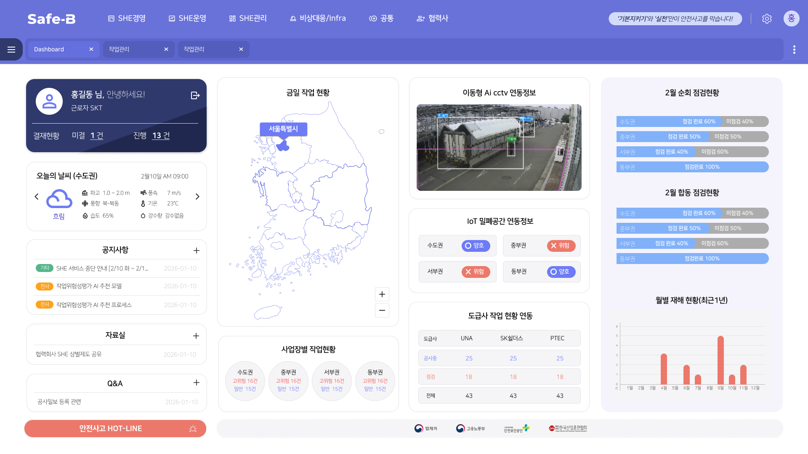
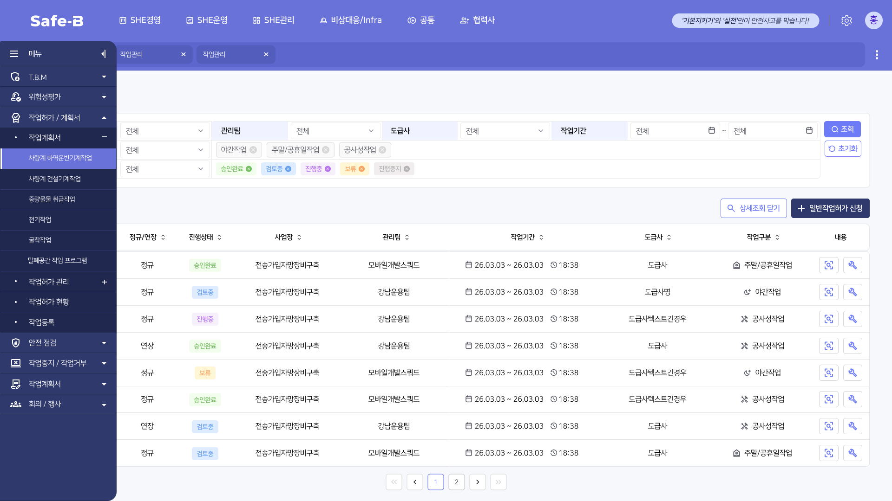

> **[핵심 Takeaway]**
> 현재 진행 중인 프로젝트로 **가장 최신 경험**이며, AI CCTV·IoT·지도 연동이 포함된 복잡한 실시간 안전관리 시스템이다.
> 단순 UI 구현을 넘어 외부 데이터 소스(AI, IoT, 지도 API)와 연동되는 인터페이스를 담당한 경험은 React 포트폴리오에서 "데이터 기반 FE 개발" 역량으로 강조해야 한다.
> 포트폴리오의 **Featured Project 1순위** 후보.

# SK브로드밴드 안전 관리 시스템 (Safe-B)

| 항목 | 내용 |
|------|------|
| 발주처 | SK브로드밴드 |
| 기간 | 2026.02 ~ 2026.09 (진행 중) |
| 역할 | 퍼블리싱 + 프론트 개발 |
| 기술 | OutSystems |
| 시스템명 | Safe-B |

---

## 시스템 개요

SK브로드밴드 건설·통신 현장의 **작업 안전 관리 시스템**. 현장 근로자의 작업허가서 발행부터 실시간 위험 감지, 월별 재해 현황 분석까지 전방위 안전 데이터를 통합 관리.

---

## 주요 화면 구성

### Dashboard (메인)



- **개인 현황 위젯:** 오늘의 날씨(수도권), 결재현황(미결/진행), 공지사항, Q&A
- **지도 기반 현황:** 서울특별시 중심 사업장 위치 시각화
- **AI CCTV 연동:** 이동형 AI CCTV 현장 실시간 영상
- **IoT 밀폐공간 연동:** 수도권/중부권/서부권/동부권 안전/위험 상태 표시
- **도급사별 작업 현황:** UNA, SK실더스, PTEC 3사 데이터 연동
- **월별 재해 현황:** 최근 1년 바 차트
- **2월 순회/합동 점검현황:** 권역별 정량 지표

### 작업허가 관리 (상세)



- 복수 조건 필터 (관리팀, 도급사, 작업기간, 야간/주말공휴일/공사작업)
- 상태 배지 시스템: 승인완료 / 검토중 / 진행중 / 보류 / 진행정지
- 정규/연장 구분, 사업장·도급사별 목록 테이블
- 상세조회 닫기 + 일반작업허가 신청 액션 버튼

---

## 주요 메뉴 구조

```
Safe-B
├── SHE경영
├── SHE운영
├── SHE관리
├── 비상대응/Infra
├── 공통
└── 협력사
    └── 작업관리
        ├── T.B.M
        ├── 위험성평가
        ├── 작업허가/계획서
        │   ├── 작업계획서
        │   │   ├── 차량계 하역운반기계작업
        │   │   ├── 차량계 건설기계작업
        │   │   ├── 중량물 취급작업
        │   │   ├── 진기작업
        │   │   └── 굴착작업
        │   ├── 밀폐공간 작업 프로그램
        │   ├── 작업허가 관리
        │   ├── 작업허가 현황
        │   └── 작업등록
        ├── 안전 점검
        ├── 작업중지 / 작업거부
        └── 회의 / 행사
```

---

## FE 개발 관점 주요 포인트

| 구현 요소 | 기술적 의미 |
|---------|------------|
| AI CCTV 실시간 영상 연동 | 외부 스트리밍 데이터 FE 처리 |
| IoT 센서 상태 표시 | 실시간 데이터 폴링/업데이트 UI |
| 지도 기반 사업장 시각화 | 지도 API 연동 인터페이스 |
| 복수 필터 + 상태 배지 시스템 | 복잡한 데이터 필터링 컴포넌트 |
| 권역별 통계 대시보드 | 집계 데이터 시각화 |
| 다중 도급사 데이터 통합 | 다중 데이터 소스 통합 UI |

---

## 포트폴리오 서술 구조

- **문제:** 통신 인프라 건설 현장의 안전사고 위험을 실시간으로 감지·대응하는 통합 시스템 부재
- **해결:** AI CCTV, IoT 센서, 지도 API를 하나의 대시보드로 통합, 작업허가-점검-재해분석 전 주기 UI 구현
- **구현:** OutSystems 기반 SPA 구조, 상태 관리 기반 필터 시스템, 실시간 데이터 바인딩
- **결과:** 현장 근로자 → 작업허가 모바일 신청, 관리자 → 실시간 현황 대시보드로 이원화된 UX 제공
- **배운 점:** 다중 외부 시스템 연동 시 FE 레이어의 데이터 정규화 중요성

---

*관련 페이지: [[career-nulenn]], [[project-gs-dashboard]], [[project-ktg-sales]]*
*최종 수정: 2026-06-07*
